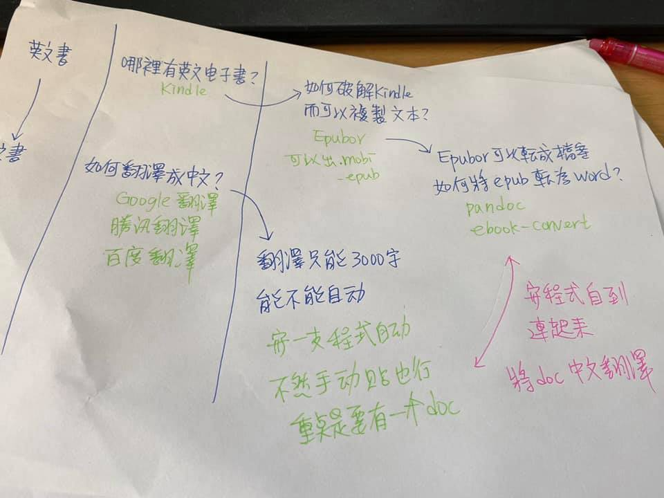
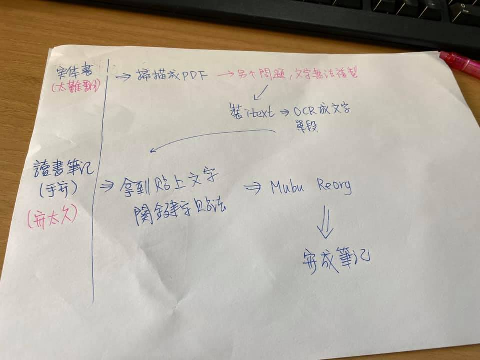
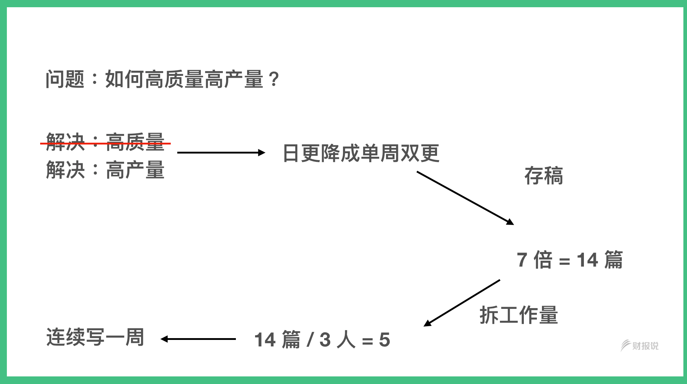
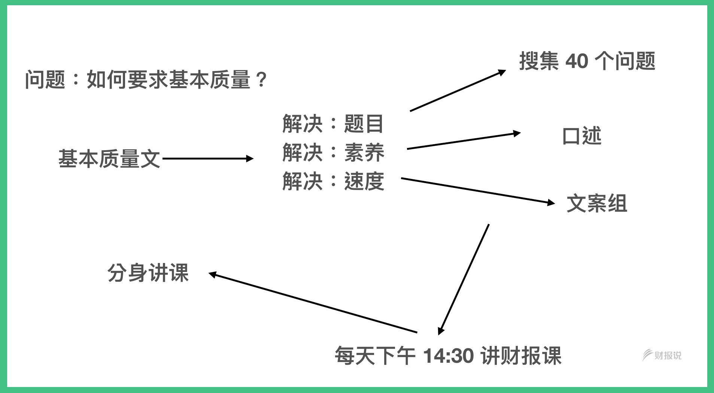
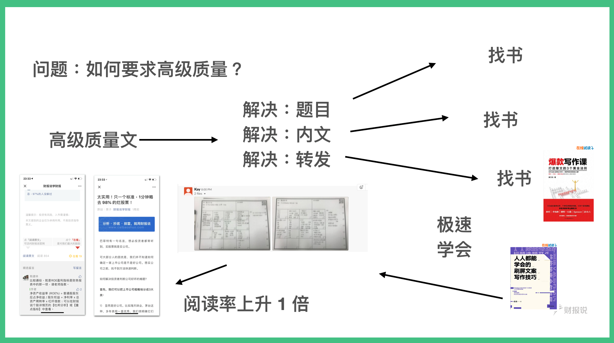
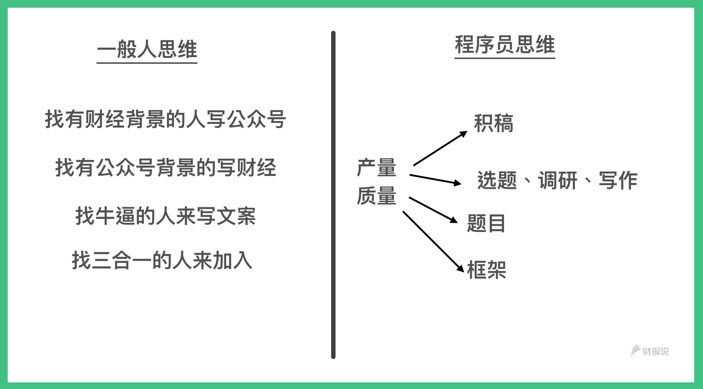
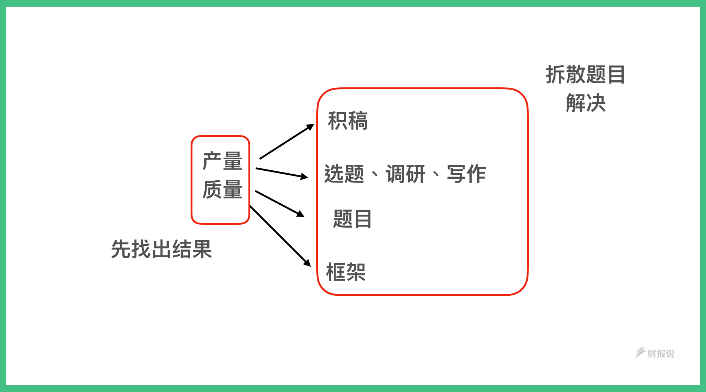
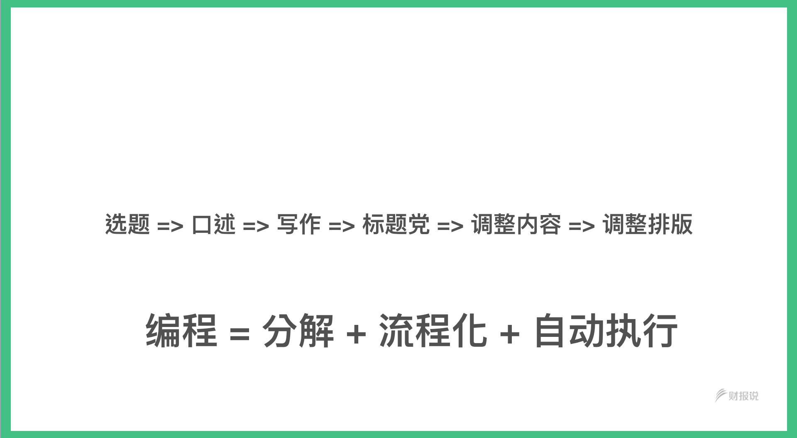
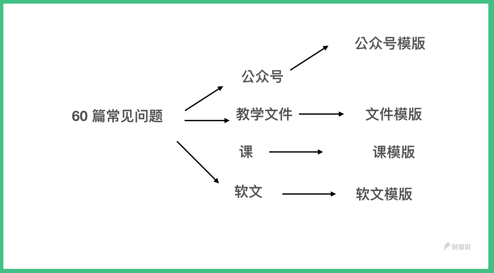

# 将问题切碎之后重组的编程思维

Netflix 二次曲线、三次曲线的手法，是将问题切碎成无数小段，逐一改善螺旋式的形成增长的曲面。并非脑门一拍的创新。

那么说到脑门一拍的东西，你还会想到什么？

编程。

## 其实大家需要学的不是编程语言，而是编程思维

身为程序员，我一点都不觉得编程是门魔法。对程序员来说，写出一套代码就是切切切，组组组。

但是对非程序员来说，最后能够出现神秘的结果，这就是魔法。

我在过去的一段时间，曾经出来开办编程学校，这个学校在当时非常受欢迎。

受欢迎到即便这个学校不做好几年，还是很多人希望如果日后有机会，我能再出来开这个班。

身为一个曾经的编程大牛与编程老师。即便已经因为兴趣转移而转行。

但是还是常常有人向我表达如果有机会的话，是否可以重新开设编程班。学会编程，似乎是这个时代里，人人都有的一个梦想。好似，学了编程就会变成超人。

过去我开设的全栈营。当年好评连连。但说实在，对于重启编程班这件事暂时真是兴趣缺缺。

* 一方面，我厌倦了重复教人家基础编程，每一梯的教学需要花费我巨大精神。且我本人没有成长。
* 一方面，很多时候，学生有时候放弃学习。不是因为课程内容本身。而是这些学生，上到一半，才发现自己没有学习编程的必要。他其实不需要也没有大段注意力，来上这种「重负担」的课。很多私下希望我重启班级的，都属于这一类朋友。

有一天，我去个认识多年的老友家喝下午茶。

这个老友目前已经接近财富自由了，月入上千万。他又开口了：\"Xdite，你那编程班啥时再开，你那编程课教得真好，真后悔当时没有好好跟你学\"。

谁问我编程都行。但这老友一问，我就挺想怼他：「你都财富自由了，学个毛线。编程学得再 6，也不可能帮你赚更多钱阿。你这么有钱，学个毛编程，花钱请个程序员帮你写不就好了唄？」

他说：「不是这样说。你那么聪明，我也想跟你有一样的大脑。我最近业务有部分上不去，想跟你学学编程，看看能不能解开。」

「业务上不去？？？」「然后想学编程？？？？」

这段话我听了一头雾水。一时之间弄不明白他这两句话当中的逻辑关系。

后来他花了一阵跟我解释，我才明白他什么意思。

他是这么思考的：他认为我拆解问题的能力非常强，往往可以把常人没什么头绪的问题简单化，轻松的拆解结构，然后解掉。他认为这应该就是什么「编程能力的展现」。

听他一说，我发现这这误会可大了。他想学的。在我认知里面，这属于「解题能力」，而不是「编程能力」。

他想学的，应该指的是解决问题的能力。而不是使用编程语言本身。

所以，我只好再次跟他解释他并不需要学编程的原因。

这段对话，已经发生在我与无数朋友的对话之间。我总是不断的劝退很多「社会有成」的朋友学编程，因为我认为它们真的不需要学「编程」（语言），也抽不了空学「编程」（语言）。

### 编程 = 拆解 + 梳理流程 + 自动化

那次的对话。电光石火当中，突然让我发现一件事：原来大家说的「编程」，指的不是同一件事？

于是我做了一次小调研，公开的问我周遭那些曾经想跟我学编程的朋友，到底为什么想跟我学编程、学编程想解决什么事？收到了一大堆的反馈之后，我才发现，原来周遭的「一般人」想学的「编程」，还真是「问题拆解的能力」，不是「编程语言」。

你会狐疑，这两者有什么不同？

在严谨的定义下是这样的：

> 编程 = 拆解 + 梳理流程 + 自动化。

当一般人向程序员表明想学编程时，程序员的反应是：

> 编程 = 自动化 + 编程语言

而一般人真的想学的是：

> 编程 = 拆解 + 梳理流程

这也难怪。会发生鸡同鸭讲的对话。

* 一般人：「我想学编程」
* 程序员：「你不需要学编程啦，你也学不了」。

编程语言之所以难学，是因为当今世界上哪一门编程语言，就算设计的再好入门，对从来没有编程概念的人来说，都是另外一维度的思考模式与表达习惯。编程语言的使用逻辑，对正常线性流程思考的人类，很难理解消化入门。

我当年学编程也是经过拼命的撞墙（中学时候铁头不怕撞），撞了几年才突然开窍。

甚至不是编程界的朋友不知道，其实当今程序员还分成两种。一种是「只懂改程式」的程序员（很多人一辈子只懂复制、修改，不懂得凭空设计架构）。一种才是懂得「设计程式」的程序员。就知道如果没人正确带入门，拆解/重组这个门槛其实挺高的。

而且，多半的情况下。很多人就算最后学会了「使用」编程语言，通常也不太等于「学会」「拆解梳理业务流程」，从而设计出合用的程式。

这也难怪无数人学编程，却纷纷从入门到放弃。

一般人能够在「不学编程语言」的情况下学会「编程思维」吗？

## 编程思维到底是什么？

「编程思维」似乎高不可攀。那也未必。

「编程思维」，是一种独特的思维模式。

我发现，这种思维模型，不只存在程序员大脑内，也往往存在各行各业内一些资深的师傅大脑里。不只有程序员才有。只是如果不在程序员身上发现，在其他行业，往往只有一些资深从业人员可能才具备这种能力。

举个比方吧。如果回想一些行业的老师傅，你是不是发现这些老师傅身上往往带有一股超能力。不管是眼前遇到多难解决的问题，就算它们从前没碰过这种问题，最却它们总能轻轻松松的拆解，再重新设计出正确且有效率的作法，好像在变魔术一般。

不过，当你向请教它们如何产生出这些解题思维，并且要如何锻炼时，它们却又说不太出来背后的来龙去脉。

其实这真是最奇怪的一件事了。

这种能力显然是「经验」累积出来的。但却可以同时出现在大量程序员身上。

难道编程界可以人造出这种思维吗？

所以，我开始去将我过去拆项目的过程重新慢格播放。才发现，还真可以人造。而且可以组织成套路。

### Example 1. 拆解如何翻译一本书

读过打造超人大脑的朋友。都知道我有一套技术，能够将国外最新的外文书，变成中文版本。但是它们丝毫不知道这是如何办到的。我就以这个例子来解释编程思维是如何解题的吧。

这个题目是如何拿到一本自动翻译好的英文书。一般人对于这个问题的想像，可能是他手上有一本英文纸本书，或者一个 epub 档。最后希望「神奇的吹一口气」，最后拿到中文的 epub 档。

我们来解析这个题目，其实这个题目，还可以拆成几个关键动作

1. 如何找到英文书源头
2. 如何翻译成中文
3. 如何把翻译结果组在一起

首先针对 \(1\) ，如何找到英文书源头。当然，本书不鼓励盗版。所以取得书籍的「原始档案」有两个方法。

* a. 扫描整本原文书，取得文稿
* b. 将 kindle 内容汇出，取得文稿

再来是针对 \(2\) 的解法。坊间有 Google 翻译。如果针对中文要有更好的结果，可以改采用百度翻译或者是腾讯翻译。然而，不管是哪一家翻译引擎，都有文字字数限制，一次只能翻译 2000-5000 字。

所以针对 \(3\) ，你可以选择两个选项

* a. 复制贴上。一本书约10万字。所以理论上你只要复制贴上约 20-50次就可以了。
* b. 写程式语言自动针对段落拆分，逐段翻译。

所谓大家外界常看到的自动化，可能只是将输入与输出介面简化。

比如说：提供一个档案上传的栏位，背后侦测这是什么档案格式，然后最后拆解成英文原始文稿，逐段自动的翻译，再把翻译结果组装回去，还你一个原格式（epub 或 doc ）的档案。

但如果你不是程序员。理论上只要按照这种拆题的方式，也可以半自动达成最后要的结果（复制贴上）

人们总是将自动这个字想得太神奇。其实程序员在拆解问题时，也是先将问题分类，再一个一个解决，最后想办法组装。

### Example 2. 如何在电脑上读电子书做笔记（极速读书法 PLUS ）

在我的极速读书法问世以后。很多读者希望这个读书法可以出改良的版本。

极速读书法的原理与操作是：

* 原本一般正常人读书是从头读到尾的理解，而极速读书法是采关键字搜寻的形式
* 读者一边阅读，一边把值得记录的段落写到特殊的16格纸里面，最后再重新整理成一篇心得。

然而这个方法还是有极限，比如如果该书密度太高，读者可能会写超过 16 格。甚至写到 48 格。或者是整本书浓度实在高到不行，光是金句就会抄到手软。太经典的书可能无法攻克

而且最重要的一个问题是，还是可以回到用电脑上做笔记吗？因为绝大多数的人都还是希望都是拿到电子书后，打开 Word 写笔记。

针对这个问题，我也有了新解，我将之命名为极速读书法 PLUS。

这个问题可以拆解成

1. 如何复制电子书的文字。
2. 如何制作出可以迅速且好修改的笔记。可以一边写笔记，却不会陷入一边写一边修的囧境。

针对（1 \) 的思路有两个。

* a. 将整本书 OCR 变成一个文件。
* b. 只将想要变成金句的文字，OCR 出来。

a. 显然成本过高，OCR 一本书在一般电脑上可能要花上20-30分钟之久，且 OCR 结果往往十分不理想。对如果有强迫症的人，错字连篇反而不容易阅读。

b. 选项是结果导向，我们只希望复制该金句，那么为何不 OCR 该句子就好。本来这个动作分两步，一步是截图，一步是 OCR。后来我在 Mac 上找到一个工具 iText，可以截图即 OCR。所以只要圈选文字范围就可以拿到文本。

那么\(2\)的解法，如何制作容易整理，又不容易陷入边读边修改的笔记呢？

我拆解了我的需求，我发现这个笔记

* a. 需要有结构
* b. 需要在我觉得有关连时刻时，轻易的搬动复制并产生新连结。

于是我找到了 mubu 这个软件。他是一个结构性笔记软件。

mubu 是巢状纯文字笔记格式，可以轻易的剪下贴上笔记，并且附著到新节点上。甚至最后很容易生成心智图。

这样就完美产生我所需要的新读书解决方案。我用了这个新方案，不但可以轻而易举的攻克那些经典大部头教科书，原先读书速度又上升了接近两倍。

### Example 3. 编程思维 = 分解 + 流程化执行（如何批量高效产生高质量专业文章）

最后，我再举一个匪夷所思的编程思维例子吧。这个例子堪称经典。我是拿来用在解决公司事务上的。

我底下有间公司，有个内容组。原先这个部门的 KPI 是要养出一个财务公众号。但是它们进度很不顺，搞了几个月搞不起来。

本来我是不觉得这事到底有什么难的。

但是不管内容部门，招了几个文案，公众号文章质量一直都上不去，内容不好，也没多少点阅率。点开来看。大家很是气馁。纷纷跟我抱怨这件事实在是不可能任务。

结果，我花了一周就解决了这件事，不仅如此，阅读量与订阅数还翻倍。

原始命题：打造一个高质量的专业公众号，文章素质高，又容易引起转发

原先内容部门的想法是这样的：

要打造一个好的公众号。先决条件是，内容要好，文章结构要好。

于是它们的思路是：

> 招聘有财经背景的人写公众号

但是实际上发现，这个思路不可行。因为，有财经背景的人，赚得钱相对比做新媒体的人工资高很多，如果只招对方来写公众号的话，根本招不来。

于是后来，它们换了一个思路。

> 找有写公众号背景的写财经

人是找到了，但是更困难。因为熟悉新媒体，写公众号的人，本身学财经速度太慢。就算能写文，内容往往也错误百出，更搔不到痛点。

所以写出的文章，也不能看。

后来它们把主意打到了外稿上。外面肯定有作者于财务知识非常熟悉，写文章又快。但是合作了一两篇之后，就觉得这买卖实在太不合算了。

因为的的确确太亏本了。更何况，就算计算不计稿费与点阅效益。对方也不可能高产的日日周周供稿。

所以内容部门一直觉得很痛苦。人招不到，文章又写不出来。认为这是不可能的任务。

#### 步骤一：重新定义 KPI

接手这个问题后，我重新思考了一下。我把这个问题重新定义，搞明白究竟这个问题要达成什么样的目标？

发现是这两个目标：

* 公众号的文章要高质量
* 公众号的文章要高产量

所以这个大问题，拆解下来，本质上是「质量」与「产量」问题。

不过我发现，产量的问题最严重。如果公众号要日更的话，内容组几乎是当天写文章，然而因为写作能力有限，光选题、写作，一天就过去了。出来的文章也只能是非常一般。难怪素质提升不上去。

我去观察了其他公众号，发现其他公众号，也是没有日更的，多半是一周双更。

如果一周双更，事情就简单好办了。写文章的强度不用那么大。

不过问题还是，没有积稿。于是当天发的文章，只能是当天产，也自然无法要求质量。所以第一个重点，应该是要求有积稿。有积稿才能买到时间，好好打磨文章。

我算了一下，如果我们要做到有库存，需要准备多少文章。我发现，单周双发的话，七倍稿量应该是够的。所以要准备 14 篇。

而公司里有 3 个文案，一人连续写 5 篇，连续写一周应该就有足够稿件。

#### 步骤二：拆解瓶颈点，逐一提升效能

理论上 3 个人，每个人连续写 5 篇，应该就能积出够用的稿子。

但实际上不是这样的。这 3 个人，本身都不是财务背景。一天要产一篇够水准的文章都够呛。

我发现，它们一天写不出一篇好文的问题在这三个关键点：

* 选题 （不知道选什么题目）
* 财务素养 （文案没有财务背景）
* 写作速度 （有财务背景的时间太贵）

于是我将这三个问题逐一拆开解决。

首先，选题问题。我让公司的人，搜集了大概 40 个很有兴趣了解的题目，并且分类。就确保了「选题问题」，保证都是大家想看的。

再来，文案的人，因为没有财务背景，于是写内容有行文上的困难。有财务背景的人，文笔却又不怎么样。

于是我将这两件事分开。每天下午 14:30，找对财经熟悉的人，选三个题目深入解答授课。它们负责将上课内容，转成文章。

 这样一拆，瞬间就产出了一堆文章。

不过下一个问题来了。这些文案组能够写出够专业素养的文章。但标题实在起的不怎样，阅读结构也不怎样，更别说让人转发。

于是，我再把「提高质量」重新分解一次。

 一篇文章，要能够称的上是好文。有三大重点：

* 题目吸睛
* 内文好看
* 看完认同转发

但是我司不可能产热文高手。让它们去上写作课，又缓不计急。

于是，我想了一个妙招。上网找了两本书，一本专攻标题的超强写作书，一本专攻内容10万+的超强写作书。

扔给内容组同事看。并规定它们要用极速读书法写心得笔记。

果然，这两本书一扔给它们看完。下午出刊的文章，质量就大大提升了。因为这些书里面不仅有核心技巧，更有下笔模版。

#### 步骤三：重新调整顺序

总结下来我的作法，其实是这样的：

一般人解决一件事，作法往往就是对著这个大问题，一顿蛮干。然后崩溃哭诉问题太难。

而编程思维的解法，是先将大问题，重新拆分成具体的小问题，然后再分类解决。手动重组顺序，最后再履顺成自动化规模。

  所以原本这个不可能的任务。就被重新定义成一个有解的新流程：

选题 =&gt; 口述 =&gt; 写作 =&gt; 标题党 =&gt; 调整内容 =&gt; 调整排版

 按照这个新流程，内容组顺利了堆积了几十篇「原料」。

我们进一步的针对每一个运营模式，做出了不同模版。

以后要制造内容，只要往模版一贴，就可以组成不同的产品。

这个手法，非常神奇。一个原先看似无解的题目，突然变成了一个漂亮的解法。

其实，这个拆解方法，就是编程思维，也是程序员标配思维。

你会发现多数高级程序员，其实非常讨厌 PM 写规格给它们。甚至觉得 PM 写太详细的规格给它们，是妨碍它们思考，以及造成实做障碍。

高级程序员接到需求或原型图后，所谓的「编程思维」顺序是这样的

1. 「用户原先要达成什么目的？」
2. 去拆解当中里面有多少个难题
3. 把这里面的难题，可以拆的先解决掉。不能拆的绕路走过，以后再解。
4. 不能拆的问题，是否我们可以定义边界，KPI 化变成有解的题目
5. 重新连结成一个新的自动顺序

最后，反覆优化这当中的过程，直到达到自动化。
